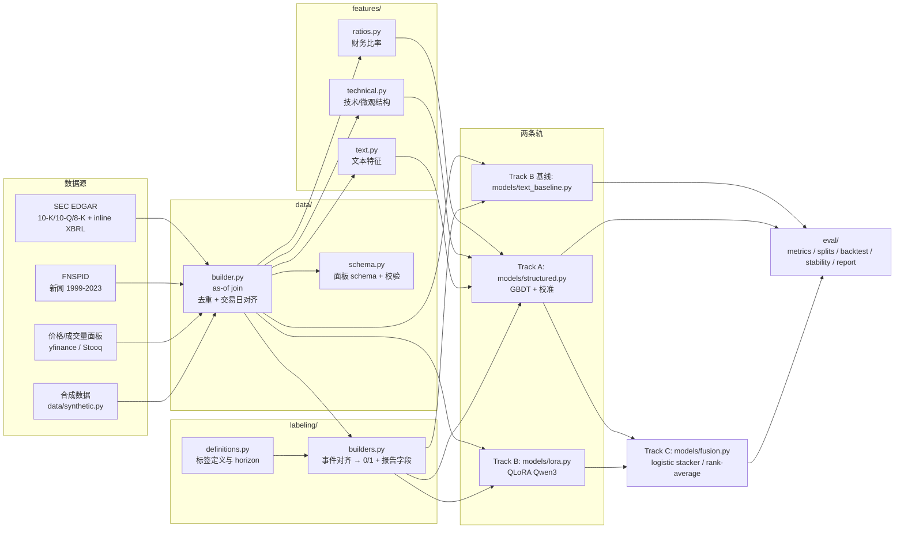

# 01 架构：双轨 + 融合

本文定义 Shingan 的整体架构、每个边界的输入/输出契约，以及明确的非目标。文中出现的所有模块路径都与仓库实际布局一致。

## 1. 问题陈述与设计目标

给定一家上市公司在某个时点的**已公开信息**，预测该实体的风险状态。三条约束塑造了整个架构：

1. **风险不是涨跌。** 标签必须是可核对的事件（评级下调、重述、执法行动、极端回撤），而不是"未来 30 天涨还是跌"。后者是 alpha，不是 risk，且信噪比极低，本项目把它固化为禁止项（见[标注](03-labeling.md)）。
2. **正样本极稀有。** 三个 in-scope 标签都是个位数百分比甚至更低的基率，因此评估以 PR-AUC / KS / 校准为主，而非 accuracy。
3. **监管语境下必须可归因。** 风控、审计、投委会需要"为什么"，而不只是"是多少"。所以输出契约强制携带可核对的证据引用。

设计目标按优先级排序：

| 优先级 | 目标 | 对应机制 |
| --- | --- | --- |
| P0 | 无数据穿越 | `data/builder.py` 的 as-of join + `leakage.py` 断言 + `eval/splits.py` 的 purge/embargo |
| P0 | 可证伪 | 强制三路对比（structured-only / text-only / fused）+ 无模型基线 |
| P1 | 分数可校准 | validation fold 上显式拟合 isotonic/Platt，fusion 也只在 validation 上拟合 |
| P1 | 输出可核对 | 输出契约中的 `evidence[]` 必须带引文片段与来源引用 |
| P2 | 单机可复现 | 合成数据 offline demo、固定种子、CPU 可跑全链路 |
| P3 | 可扩展到全 S&P 500 / 20 年 | 面板式数据模型，特征与标签解耦于公司数量 |

## 2. 为什么单一 LoRA 不行

一个自然的起点是把 20 年年报全文 + 全部新闻 + 交易信号序列化成一个大文本，用一个 LoRA 端到端预测风险。本项目明确否决了这个做法，理由是三条互相独立的：

**2.1 归纳偏置错配。** 财务比率与量价特征构成一个宽而浅的数值面板（数千家公司 × 数千个交易日），列之间高度相关、量纲各异、有缺失。这类数据的最优函数类是与单调变换近似不变、自带正则、对特征缩放不敏感的树集成。把它们 token 化成数字串喂给自回归模型，等于主动丢弃数值大小与相对次序的先验，用样本效率低一到两个数量级的模型去做同一件事。结构化信号应当交给传统模型：稳定、可解释、易校准。

**2.2 无法回答核心问题。** 项目要证明的是"文本带来了数字里没有的信息"。单一 LoRA 把两类信号混在一组不可分解的权重里，任何性能数字都无法归因：不知道是文本读懂了风险因子章节，还是模型记住了 `debt_to_equity` 这个数字的分布。双轨让 text-only 成为一条**可以单独训练的基线**，融合增益因此可测量。

**2.3 标签 horizon 与文本长度冲突。** 三个标签的 horizon 是 365 / 730 日历日与 30 个交易日，差异达一个数量级。把它压成单一分类任务会迫使最长 horizon 主导梯度；双轨 + 多标签头可以在同一份特征上分别监督，且不需要在文本里塞入"距离事件还有多久"这种会泄漏的信息。

被否决的是"**单一 LoRA 吞下全部输入**"这个架构，不是 LoRA 本身。LoRA 保留，但只作用于文本轨。

## 3. 架构总览



## 4. 三条轨

### 4.1 Track A — 结构化（GBDT）

- 代码：`src/shingan/models/structured.py`
- 输入：`features/ratios.py`（财务比率）+ `features/technical.py`（技术/微观结构）+ `features/text.py` 的**计数类**聚合（例如近 30 天新闻条数、情感均值与波动）。注意：计数类文本特征属于结构化侧，因为它不携带语义；语义由 Track B 负责。
- 模型：gradient-boosted trees（LightGBM/XGBoost 系）。选它的理由是可处理缺失值、对特征缩放不敏感、训练在 CPU 上可完成、且能输出可归因的特征贡献。
- 输出：每个 `(ticker, as_of, label)` 一个原始分数 → validation fold 上拟合 isotonic（样本量足够时）或 Platt（样本稀缺时）得到校准概率。
- 校准的硬约束：**只在 validation fold 上拟合校准器**。`CalibratedClassifierCV(cv="prefit")` 一类 API 在新版 scikit-learn 中已废弃，本项目不使用；见[评测框架](05-evaluation.md)的陷阱清单。
- 不做 target encoding：面板数据里按公司/行业均值编码会把未来信息经标签泄漏回特征，且与 as-of 语义冲突。类别变量只做 one-hot 或原生 categorical 处理。

### 4.2 Track B — 文本（QLoRA on Qwen3）

- 代码：`src/shingan/models/lora.py`（指令微调）、`src/shingan/models/text_baseline.py`（非 LLM 基线）、`src/shingan/prompts.py`（模板）
- 底座：`Qwen/Qwen3-14B`，4-bit nf4 QLoRA。选型推导与显存预算见[训练](04-training.md)；HF 发布名为 `shuurai2000/shingan-qwen3-14b-finrisk`。
- 输入：某 `as_of` 之前已公开的 10-K/10-Q/8-K 摘录 + 新闻条目 + 一段结构化信号的自然语言摘要。构造见 `shingan data sft`。
- 输出：一份 JSON，包含 `label`、`severity`、`score`、`horizon_days`、`reasons[]`、`evidence[]`。其中 `score` 才是融合层使用的连续量；其余字段用于人类复核。
- `text_baseline.py` 提供一条**非 LLM** 的 text-only 路径（词袋/TF-IDF + 线性模型）。它存在的意义是区分"文本有用"与"LLM 有用"：如果 TF-IDF 基线已经追平 14B LoRA，那么 LoRA 的增量价值需要重新论证。

### 4.3 Track C — 融合

- 代码：`src/shingan/models/fusion.py`
- 两种可切换模式，由 `configs/eval/*.yaml` 的 `fusion.mode` 选择：
  - `logistic_stacker` — 以 `(score_a, score_b)` 为输入的 logistic 回归。可解释（两个系数直接读出各自的权重），是小样本下的默认选择。
  - `rank_average` — 对两条轨的分数先做**逐日横截面排名**再取加权平均。对分布漂移更稳健，不需要额外参数，作为 stacker 的对照。
- 硬约束：融合层的参数（权重或系数）**只在 validation fold 上拟合，绝不在 test 上拟合**。test 上只做一次前向计算。
- 融合层的输入只允许是两条轨的分数（以及可选的常数项）。不允许把原始特征再喂进来——那会让 fused 与 structured-only 的比较失去意义。

## 5. 边界输入契约

每一处跨模块边界都有显式契约，`data/schema.py` 负责校验。

| 边界 | 生产者 → 消费者 | 契约（必须有 / 必须没有） | 违反时的处置 |
| --- | --- | --- | --- |
| raw → interim | 外部源 → `data/edgar.py` `data/news.py` `data/prices.py` | 保留原始响应字节与 `fetched_at`；EDGAR 请求必须带合规 `User-Agent`；news 保留原始发布时间戳与源 URL | 缺 `fetched_at` 或源引用直接拒绝入库 |
| interim → features | `data/builder.py` → `features/*` | 每一行必须有 `as_of`（交易日，UTC 日期）；所有源字段必须满足 `source_timestamp <= as_of` | `leakage.py` 抛错并中止构建 |
| features → labels | `data/builder.py` → `labeling/builders.py` | 特征与标签分表存放；标签表携带 `event_date`、`source_of_record`、`horizon_days` | 禁止把 `event_date` 写进特征表 |
| features+labels → Track A | `data/processed/` → `models/structured.py` | 输入矩阵 X 不含任何标签派生列；`leakage.py` 校验列名前缀黑名单（`label_`、`fwd_`、`event_`） | 命中黑名单即中止 |
| features+labels → Track B | `data/sft/*.jsonl` → `models/lora.py` | 每条样本的文本只能包含 `as_of` 时点前已公开内容；prompt 中不得出现 `as_of` 之后的日期字符串 | 训练前扫描 prompt，命中未来日期即报告 |
| Track A/B → Track C | 两个分数向量 → `models/fusion.py` | 两条分数必须对齐到同一组 `(ticker, as_of)`，且**同一份切分** | 对齐失败或切分不一致即中止 |
| 任意 → 报告 | `eval/report.py` | 报告必须记录切分定义、校准器拟合区间、融合层拟合区间、代码版本 | 缺任一字段的报告不视为有效结果 |

`configs/` 的解析规则：`configs/default.yaml` 提供全量默认值，`configs/data/*.yaml`、`configs/train/*.yaml`、`configs/eval/*.yaml` 是叠加层（overlay），CLI 参数优先级最高。所有 YAML 用 pydantic v2 模型校验（`config.py`），未知字段报错而非静默忽略。

## 6. 数据流

```
source → interim → features + labels → 两条轨 → fusion → evaluation
```

1. **Source**。EDGAR（10-K/10-Q/8-K 全文 + inline XBRL 数值事实）、FNSPID（新闻 + 情感）、价格/成交量面板。合成数据是第四条离线来源，只用于 POC。详见[数据](02-data.md)。
2. **Interim**。按公司+日期归档的中间产物，保留源引用与抓取时间。POC 阶段允许近似重复，去重发生在下一步。
3. **Build**。`data/builder.py` 做三件事：多源去重、交易日对齐、as-of join。输出 `data/processed/` 下的面板：每行 `(ticker, as_of)`，列含特征、标签与元数据。字段清单见[数据](02-data.md)的数据字典一节。
4. **Tracks**。Track A 读结构化列直接训练；Track B 通过 `shingan data sft` 把同一批行渲染成指令 JSONL 再训练。
5. **Fusion**。两条分数在 validation 上拟合融合参数，在 test 上前向计算一次。
6. **Evaluation**。`eval/` 下五个模块：`splits.py`（切分与 purge/embargo）、`metrics.py`（排序/校准/IC）、`backtest.py`（横截面分位回测）、`stability.py`（滚动窗口与 PSI/CSI）、`report.py`（渲染 markdown）。

## 7. 输出契约（证据化）

任何对外暴露的风险判断都是一条 JSON：

```json
{
  "ticker": "JPM",
  "as_of": "2020-03-01",
  "label": "default_risk",
  "severity": "high",
  "score": 0.37,
  "horizon_days": 365,
  "calibrated": true,
  "model": "shingan-qwen3-14b-finrisk+fused",
  "reasons": [
    "评级展望在最近两期 10-Q 中连续转为负面表述",
    "利息覆盖倍数同比下滑且负债结构短期化"
  ],
  "evidence": [
    {
      "source_type": "10-Q",
      "source_ref": "CIK 0000019617, 10-Q 2019-11-01, Item 1A",
      "quote": "adverse changes in credit markets could constrain our liquidity",
      "span": [41280, 41353]
    },
    {
      "source_type": "news",
      "source_ref": "FNSPID article_id=..., published 2020-02-24",
      "quote": "the bank flagged higher provisions for credit losses",
      "span": [0, 51]
    }
  ],
  "signal_attribution": {
    "structured_top": ["interest_coverage", "debt_short_term_ratio", "vol_60d"],
    "text_score": 0.41,
    "structured_score": 0.31,
    "fusion_weight_text": 0.58
  }
}
```

字段约束：

| 字段 | 类型 | 约束 |
| --- | --- | --- |
| `label` | enum | `default_risk` / `fraud_risk` / `tail_risk` |
| `severity` | enum | `low` / `medium` / `high` / `critical`，由校准分数按固定阈值映射，阈值记录在 config 中 |
| `score` | float | `[0, 1]`，必须来自 validation fold 上拟合的校准器 |
| `horizon_days` | int | 与标签定义严格一致：365 / 730 / 30（`tail_risk` 的 30 为交易日） |
| `calibrated` | bool | 若为 `false`，下游不得把 `score` 当作概率使用 |
| `reasons[]` | string[] | 每条必须是可核对陈述，不得出现无法验证的因果断言 |
| `evidence[]` | object[] | **非空**（`severity >= medium` 时），且每项的 `quote` 必须是对应 `source_ref` 的**逐字子串** |
| `source_ref` | string | 能唯一定位原始文档：CIK + 表单类型 + 申报日 + 章节，或新闻 ID + 发布时间 |

`evidence[]` 的 `quote` 必须通过子串校验：报告生成时会拿 `quote` 回到源文本中做 `in` 检查，失败则该条 evidence 被丢弃并记入日志。这条校验由 `eval/report.py` 执行，不是建议。

### 为什么证据引用是硬需求

在受监管的风险语境里，一个没有引用来源的风险分数无法进入任何流程：

- **审计与合规**：分数必须能追溯到具体的公开披露。没有出处，等于要求审计师信任一个黑箱。
- **防幻觉**：逐字子串校验把"引用"从修辞变成可验证断言。LLM 编造的句子无法在源文档中找到，会被机械地剔除。
- **人工复核成本**：复核者需要的是"翻到这一段"，而不是"再看一遍整份 10-K"。
- **可追责性**：当模型判断错误时，必须能区分"文本里根本没有这个信息"（召回失败）与"文本里有但模型没读懂"（能力失败）。这是后续迭代方向的分水岭。

### 与 alpha 的边界

本项目输出的是**风险度量**，不是交易信号。`tail_risk` 的 horizon（30 个交易日）与横截面分位回测看起来像量化策略，但回测的目的是**验证分数的经济意义与排序稳定性**，不是生成可交易的仓位。任何把 `score` 直接映射成头寸的做法都超出本项目范围与许可意图。

## 8. 非目标

明确不做，且不接受的 PR：

| 非目标 | 原因 |
| --- | --- |
| 用"未来涨跌方向"作为标签 | 那是 alpha 不是 risk，信噪比极低；见[标注](03-labeling.md) |
| 单一 LoRA 端到端预测风险 | 见本文第 2 节与 [ADR-0003](adr/0003-dual-track-over-single-lora.md) |
| 预测黑天鹅 / 无历史先例事件 | 无训练分布可言；列为已知失效边界 |
| 内部操作风险（系统故障、流程失误） | 除非经 8-K 披露，否则不在公开数据中 |
| 主权 / 政治风险 | 超出 US-listed 数据覆盖 |
| 实时低延迟推理服务 | POC 目标是可复现的离线评测，不是线上系统 |
| 投资建议 / 交易系统 / 信用或审计尽调的替代品 | 见[模型卡模板](../templates/model_card.md) 的 intended use |
| `liquidity_risk` / `event_driven_risk` / `macro_contagion_risk` | 定义已在[标注](03-labeling.md)中记录，但超出 POC 范围 |
| 生成式"风险故事"文本评测 | 可读性不是本文的评测对象，`reasons[]` 只作为归因手段 |

## 9. 相关文档

- 数据来源与处理纪律：[02 数据](02-data.md)
- 标签定义与 JSONL schema：[03 标注](03-labeling.md)
- 训练配置与显存预算：[04 训练](04-training.md)
- 切分、指标与验收门槛：[05 评测](05-evaluation.md)
- 平台约束的决策记录：[ADR-0002](adr/0002-training-stack-windows.md)
